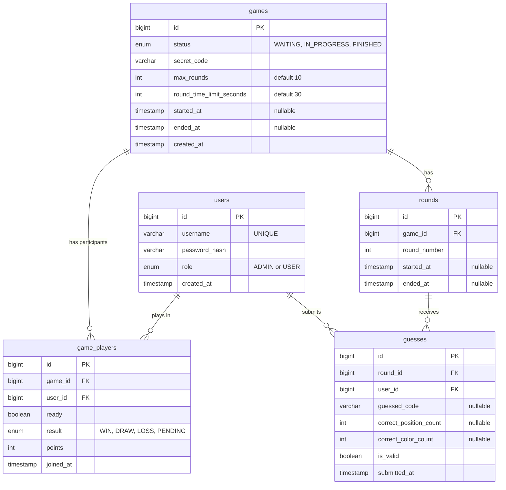

# Codecracker — Multiplayer Mastermind

A multiplayer, WebSocket-driven implementation of Mastermind, built with
Vert.x 5 (Java) on the backend and TypeScript/Vite on the frontend.

## Table of contents

- [Getting started](#getting-started)
- [ER diagram](#er-diagram)
- [REST API](#rest-api)
- [WebSocket API](#websocket-api)
- [Requirements checklist](#requirements-checklist)

## Getting started

### Requirements

- Podman or Docker (with Compose)
- Node.js LTS (for frontend development outside a container)
- A JDK 21+ and Maven (for backend development outside a container)

### 1. Configure environment variables

```bash
cp .env.example .env
```

`.env` (gitignored) supplies the database credentials and JWT secret used
by both `docker-compose.yml` and the backend's own config (`AppConfig`,
which falls back to the same defaults if a variable is unset):

| Variable | Purpose | Default |
|---|---|---|
| `DB_ROOT_PASSWORD` | MariaDB root password | `root-secret` |
| `DB_NAME` | Database name | `codecracker` |
| `DB_USER` | App database user | `codecracker` |
| `DB_PASSWORD` | App database password | `secret` |
| `DB_HOST` | Database host | `mariadb` (container name) / `127.0.0.1` (local dev) |
| `DB_PORT` | Database port | `3306` |
| `JWT_SECRET` | HMAC secret used to sign/verify JWTs | dev-only placeholder — **change before any real deployment** |

The values in `.env.example` are for local development only.

### 2. Start the full application (Podman/Docker Compose)

```bash
podman compose up --build
```

Waits for MariaDB to report `healthy` before starting the backend
container. First start (image pull, DB init, build) can take a while —
check progress with:

```bash
podman compose ps
```

| App | URL |
|---|---|
| Codecracker (frontend + backend, same origin) | http://localhost:8080 |
| phpMyAdmin | http://localhost:8081 |

An initial admin account is seeded automatically on first DB init
(`mariadb/mariadb_init/00-init.sql`): **username `admin`, password
`Admin1234`** — a local development credential; rotate it (or the bcrypt
hash in that file) before using this schema anywhere but your own machine.

### 3. Development mode (hot-reload frontend/backend separately)

Only start the database and phpMyAdmin via Compose:

```bash
podman compose up mariadb phpmyadmin
```

Run the backend from your IDE:

```
backend/src/main/java/de/thm/codecracker/Main.java
```

Watch the console for `Server started on port 8080`.

Run the frontend separately, with hot reload:

```bash
cd frontend
npm ci
npm run dev
```

| App | URL |
|---|---|
| Backend | http://localhost:8080 |
| Frontend (dev server, proxies `/api` and `/ws` to the backend) | http://localhost:5173 (Vite prints the actual port) |
| phpMyAdmin | http://localhost:8081 |

### Note on the bundled Todo demo

The project template ships a fully working, deliberately **unauthenticated**
Todo feature (`todo` package, `/api/todos`, `/ws/todos`) purely to
demonstrate the Controller → Service → Repository layering and the
REST/EventBus/WebSocket wiring pattern this project reuses for Lobby and
Game. It is not part of the graded functionality.

## ER diagram



### Entities

- **`users`** — one row per account. `role` distinguishes `ADMIN` from
  `USER`; `password_hash` is a bcrypt hash, never the plaintext password.
- **`games`** — one row per played (or in-progress) game. Holds the secret
  code and the base-configuration values (`max_rounds`,
  `round_time_limit_seconds`) as columns rather than constants, in case a
  difficulty setting is added later. `status` starts at `IN_PROGRESS`
  directly (see note below) and moves to `FINISHED` once a winner is
  found, the round limit is reached, or every player has forfeited.
- **`game_players`** — the join table between `users` and `games`,
  carrying per-player data for that specific game: whether they confirmed
  readiness (`ready`), their `result`, and the points they earned. A
  `UNIQUE (game_id, user_id)` constraint means a user can only appear once
  per game.
- **`rounds`** — one row per round of a game, numbered `1..max_rounds`.
  `ended_at` is `NULL` while a round is still open; `UNIQUE (game_id,
  round_number)` prevents duplicate round numbers within one game.
- **`guesses`** — one row per player per round: the code they submitted
  and the server-computed feedback (`correct_position_count`,
  `correct_color_count`). `is_valid` is `false` for an incomplete
  auto-submitted code at timeout, in which case the feedback columns and
  `guessed_code` stay `NULL` — an incomplete guess is recorded as *having
  happened*, without ever being evaluated as if it were a real one.
  `UNIQUE (round_id, user_id)` — one guess per player per round.

### Note: `games.status = 'WAITING'` is defined but currently unused

The `WAITING` status exists in the schema for a game that has been
created but hasn't started yet — but nothing in the current code ever
creates a game in that state. The invite/ready-check flow (who's playing)
is resolved entirely in memory *before* any `games` row is ever inserted
(see [`GameInviteService`](#game-invite--ready-check) below); by the
time `GameRepository.createGame` runs, the players are already decided,
so the game is created directly as `IN_PROGRESS`. `WAITING` is kept in
the schema as a natural extension point (e.g. if a future feature wanted
to persist pending invites), not because anything relies on it today.

### Note: the lobby and the pending invite are *not* in this diagram

Who is currently online, and the state of a pending "someone wants to
start a game" invite (who was invited, who has responded, the 30s
countdown), live entirely in server memory (`LobbyRegistry`,
`GameInviteService`/`InviteSession`) and are never written to the
database. They stop existing the moment the backend process restarts —
which is fine, since neither means anything beyond "right now."

## REST API

All endpoints return JSON. Error responses have the shape
`{"error": "message"}`. Every route except `/api/auth/*` requires a valid,
non-expired JWT — sent as `Authorization: Bearer <token>` — or the request
is rejected with `401` before it reaches any controller logic.

### Auth

| Method | Path | Auth | Request body | Success | Notes |
|---|---|---|---|---|---|
| POST | `/api/auth/register` | none | `{"username","password"}` | `201` + public User | `409` if the username is taken; `400` for invalid input |
| POST | `/api/auth/login` | none | `{"username","password"}` | `200` `{"token": "<jwt>"}` | `401` for either an unknown username or a wrong password — deliberately the same error either way |

### User management (admin only)

Every route below additionally requires the caller's JWT role claim to be
`ADMIN`, checked *after* the JWT itself is validated; a non-admin gets
`403`.

| Method | Path | Request body | Success | Notes |
|---|---|---|---|---|
| GET | `/api/users?search=<term>` | – | `200` + array of public Users | `search` is optional, matches by username |
| GET | `/api/users/:id` | – | `200` + public User | `404` if not found |
| POST | `/api/users` | `{"username","password","role"}` | `201` + public User | `409` if username taken |
| PUT | `/api/users/:id` | `{"username","role","password"}` | `200` + public User | `password` optional — omit to keep the existing one; `409` if renaming into an existing username, or if this would leave zero admins |
| DELETE | `/api/users/:id` | – | `204` | `409` if this is the last remaining admin |

A public User is `{"id","username","role","createdAt"}` — the password
hash is never returned.

### Lobby

| Method | Path | Request body | Success | Notes |
|---|---|---|---|---|
| GET | `/api/lobby` | – | `200` + `[{"id","username"}, ...]` | Snapshot of everyone currently connected to the Lobby WebSocket; used to recover state on page load without waiting for the first WS event |

### Game invite / ready-check

Implements "any lobby player can start a game, everyone online gets 30
seconds to confirm." Only one invite/game can be active across the whole
lobby at a time.

| Method | Path | Request body | Success | Notes |
|---|---|---|---|---|
| GET | `/api/lobby/invite` | – | `200` + phase snapshot (see below) | For recovering state on page load/refresh |
| POST | `/api/lobby/invite/start` | – | `201` + phase snapshot | Invites everyone currently online; caller is auto-marked ready. `409` if an invite/game is already active, or if the caller isn't connected to the lobby socket, or fewer than 2 users are online |
| POST | `/api/lobby/invite/respond` | `{"ready": true\|false}` | `204` | `403` if the caller wasn't invited (e.g. connected after the invite started); `409` if there's no pending invite to respond to |

Phase snapshot shapes:
```jsonc
{"phase": "NONE"}
{"phase": "INVITE_PENDING", "initiator": {"id","username"}, "deadlineAt": 1234567890123, "players": [{"id","username","status": "pending"|"ready"|"declined"}]}
{"phase": "GAME_RUNNING", "gameId": 42, "playerUserIds": [1, 2]}
```

### Game

| Method | Path | Request body | Success | Notes |
|---|---|---|---|---|
| GET | `/api/games/:id` | – | `200` + game snapshot | `404` if the game doesn't exist **or** the caller isn't a player in it — deliberately indistinguishable, so a stranger can't tell a real game apart from a nonexistent one |
| POST | `/api/games/dev-start` | `{"userIds": [1, 2]}` | `201` `{"id": <gameId>}` | **Temporary, dev-only.** Bypasses the invite flow entirely for manual testing. Should be deleted now that `feature/game-invite` exists and is the real way to start a game |

Game snapshot (`GET /api/games/:id`) — always only the *caller's own*
guess history, never another player's:
```jsonc
{
  "id": 42, "status": "IN_PROGRESS", "maxRounds": 10, "roundTimeLimitSeconds": 30,
  "myResult": "PENDING",
  "roundNumber": 3, "roundStartedAt": 1234567890123, "roundEnded": false,
  "history": [
    {"roundNumber": 1, "guessedCode": "RGBY", "correctPosition": 1, "correctColor": 2, "isValid": true}
  ]
  // "results" is added once status is "FINISHED":
  // "results": [{"userId","username","result","pointsThisGame","totalPoints"}, ...]
}
```

## WebSocket API

Browsers can't set an `Authorization` header during a WebSocket handshake,
so both sockets take the JWT as a `token` query parameter instead; an
invalid/expired token gets a plain `401` and the connection is never
upgraded.

### `/ws/lobby`

Presence + invite events only — no client-sent commands.

**Connect:** `wss://host/ws/lobby?token=<jwt>`

**Server → client events** (all `{"type": ..., "payload": ...}`):

| type | payload | Sent when |
|---|---|---|
| `player-joined` | `{"id","username"}` | A user's *first* open tab connects (opening a second tab for an already-online user does not re-fire this) |
| `player-left` | `{"id","username"}` | A user's *last* open tab disconnects |
| `game-invite-started` | `{"initiator":{"id","username"},"deadlineAt","players":[...]}` | Someone starts a game |
| `game-invite-status` | `{"id","username","status":"ready"\|"declined"}` | An invited user responds |
| `game-invite-cancelled` | `{"reason":"not-enough-ready"\|"start-failed"}` | The 30s window closes with fewer than 2 ready |
| `game-started` | `{"gameId","playerUserIds":[...]}` | Enough players confirmed; ready players' clients should redirect to `/pages/game.html?id=<gameId>` |
| `lobby-game-ended` | `{"gameId"}` | The game that was running has finished — re-enables starting a new one |

### `/ws/game`

One connection per player, scoped to one game.

**Connect:** `wss://host/ws/game?token=<jwt>&gameId=<id>` — the caller
must actually be a player in that game (checked before the upgrade
completes) or the connection is rejected with `403`.

**Client → server commands**, each with a caller-chosen `requestId` echoed
back in the response:

| type | payload | Response payload | Notes |
|---|---|---|---|
| `submit-guess` | `{"code":"RGBY"}` | `{"isValid","guessedCode","correctPosition","correctColor","submittedAt"}` | `code` may be incomplete/`null` for an auto-submit at timeout — recorded as invalid, no feedback computed |
| `forfeit` | `{}` | `{"forfeited": true}` | Immediately records a `LOSS` for the caller |

Command errors come back as `{"type":"response","requestId":...,"error":"message"}`
instead of a `payload`.

**Server → client public events** (broadcast to every player in the game,
address `game:<gameId>`):

| type | payload | Sent when |
|---|---|---|
| `round-started` | `{"roundNumber","roundStartedAt","roundTimeLimitSeconds"}` | A new round begins (including round 1, implicitly, via the game's own creation) |
| `round-ended` | `{"roundNumber"}` | Every active player has submitted, or the round's timer fired |
| `player-forfeited` | `{"userId","username"}` | A player forfeits |
| `game-ended` | `{"results":[{"userId","username","result","pointsThisGame","totalPoints"}, ...]}` | A winner is found, the round limit is reached, or every player has forfeited |

**Server → client private event** (only to the submitting player,
address `game-guess:<userId>`) — same shape as `submit-guess`'s REST-style
response, pushed instead of returned, so late joiners/reconnects still get
their own feedback:

| type | payload |
|---|---|
| `guess-result` | `{"isValid","guessedCode","correctPosition","correctColor","submittedAt"}` |

